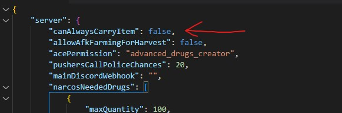
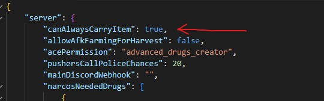
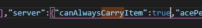
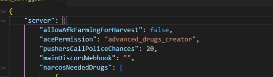
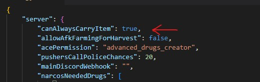
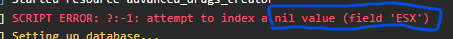
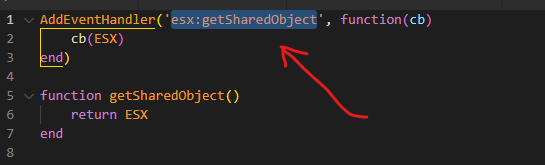
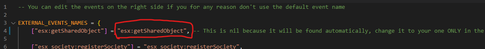

<AccordionGroup>
  <Accordion title="Fix server crash on script start">
    If your server crashes when starting the script, it means you are using an old version of the `mysql-async` script.

    Fixing this issue is very simple and fast, you have 2 options:

    <CardGroup cols={2}>
      <Card title="Install OxMySQL" icon="database" href="https://overextended.dev/oxmysqwl/">
        **Strongly recommended.** Replaces `mysql-async` with improved performance and full compatibility, allowing an easy swap. Check the installation guide for details.
      </Card>

      <Card title="Update mysql-async" icon="download" href="https://github.com/brouznouf/fivem-mysql-async">
        **Not recommended.** Install the updated script instead of your current `mysql-async`. Be sure to rename the script folder to `mysql-async`.
      </Card>
    </CardGroup>
  </Accordion>

  <Accordion title="Issues with items">
    It may happen that if you have particular inventories, item addition or removal causes errors in server console.

    In this case, to try fixing the issue try doing the following steps:

    <Steps>
      <Step title="Disable item exists check">
        Go in the script folder in `integrations/sv_integrations.lua` file and set this option from

        ```lua
                SKIP_ITEM_EXISTS_CHECK = false
        ```

        to

        ```lua
                SKIP_ITEM_EXISTS_CHECK = true
        ```
      </Step>
      <Step title="Enable canAlwaysCarryItem">
        If the script has a `default_config.json` file, edit this option in the `"server"` section from

        ```json
                "canAlwaysCarryItem": false,
        ```

        to

        ```json
                "canAlwaysCarryItem": true,
        ```

        <Frame caption="Before">
          
        </Frame>

        <Frame caption="After">
          
        </Frame>

        If the script has a `current_config.json` file (which is a different file from the previous one), edit the `canAlwaysCarryItem` option to `true` there as well.

        <Frame caption="Before">
          !\[Before\](../.gitbook/assets/current\_config\_can\_always\_carry\_before (1).jpg)
        </Frame>

        <Frame caption="After">
          
        </Frame>

        <Accordion title="What to do if I don't have the canAlwaysCarryItem option?">
          If you don't have the `canAlwaysCarryItem` option, you simply need to add it. Be sure to add it at the **beginning** of the `server` part.

          <Frame caption="Before">
            
          </Frame>

          <Frame caption="After">
            
          </Frame>
        </Accordion>
      </Step>
      <Step title="Verify the item exists">
        The item you are working on must exist to be used in the scripts. To be sure the item exists, you can try to give it to yourself.

        Creating the item depends on your framework and/or on your inventory, so creating it will be up to you.
      </Step>
    </Steps>
  </Accordion>

  <Accordion title="Manually set ESX shared object">
    On ESX, it may happen for many reasons that you encounter the following error (in F8 console or in server console):

    <Frame>
      
    </Frame>

    This usually happens because the script cannot find the _ESX shared object_ of your `es_extended` script automatically.

    To solve the issue, you have to find the shared object name of your `es_extended` script in the file `es_extended/client/common.lua`.

    This is an example of what you can find (you may have something else):

    <Frame>
      
    </Frame>

    After you found your _ESX shared object_ name, you can manually set it in the files `integrations/sv_integrations.lua` **and** `integrations/cl_integrations.lua`, replacing `nil` with the name of your shared object **(between double quotes)**.

    Do **not** replace the left side, only replace the right side.

    An example:

    <Frame>
      
    </Frame>
  </Accordion>
</AccordionGroup>